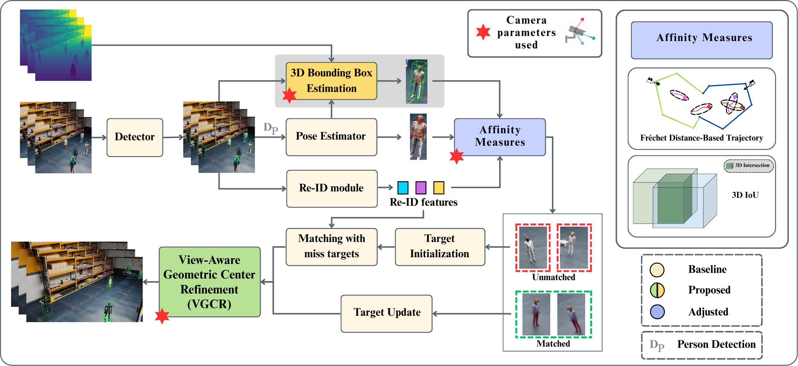

# VGCRTrack: Multi-Camera 3D Tracking with View-Aware Geometric Center Refinement

<p align="center">
  Official repository for our submission to the <b>9th NVIDIA AI City Challenge 2025</b> - Track 1: Multi-Camera 3D Perception, 
  presented at the <b>ICCV 2025 Workshop</b>. 
</p>

## Overall Pipeline
<p align = "center">
  
</p>
This is the overall pipeline of our work in the VGCRTrack.

## Dataset 
The official datasets of the Track is available at [AI City Challenge](https://huggingface.co/datasets/nvidia/PhysicalAI-SmartSpaces). 

## Acknowledgement
This work builds upon [**PoseTrack**](https://github.com/ZhenyuX1E/PoseTrack), the official implementation of:  

**A Robust Online Multi-Camera People Tracking System With Geometric Consistency and State-aware Re-ID Correction**  
*Xie et al., CVPRW 2024*  

```bibtex
@inproceedings{DBLP:conf/cvpr/XieNYZCZM22,
  author={Zhenyu Xie and Zelin Ni and Wenjie Yang and Yuang Zhang and Yihang Chen and Yang Zhang and Xiao Ma},
  title={A Robust Online Multi-Camera People Tracking System With Geometric Consistency and State-aware Re-ID Correction},
  year={2024},
  cdate={1704067200000},
  pages={7007-7016},
  url={https://doi.org/10.1109/CVPRW63382.2024.00694},
  booktitle={CVPR Workshops},
  crossref={conf/cvpr/2024w}
}

